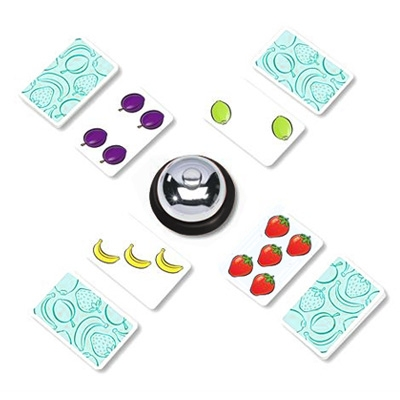

# HalliGali_Game
### 할리갈리 게임 구현
#### Team Member : 박건형
#### Project Period : 2021/05/19 ~ 2021/06/09
----

## 프로젝트 개요
C언어, 소캣, IPC를 활용하여 할리갈리 게임을 구현 했습니다.<br>

>할리갈리 게임이란 아래 그림과 같이 중간에 종을 놓고 게임 참가자 들이 순서에 맞게 자신의 카드패 에서 한장씩 카드를 뒤집습니다. 그러다 뒤집힌 카드들 에서 같은 종류의 과일의 합이 5이면 밸을 빠르게 눌러 이기는 게임입니다.<br>



**구성 프로그램**
- 게임의 모든 이벤트를 관장하는 서버 
- 게임에 참여하는 클라이언트


## 다이어그램


## 프로젝트 실행
```bash
$ ./center

# 새로운 터미널 열기

$ ./user

# 새로운 터미널 열기

$ ./user
```

## 프로젝트 실행화면
> 최초 실행시 user 입장과 동시에 카드를 보여주고 턴마다 enter를 입력하면 턴을 진행합니다. center는 drop된 카드들을 기록합니다. 그리고 사진 아래쪽을 보면 bell press 이벤트가 발생한 것을 볼 수 있습니다. p를 입력한 user1쪽이 점수 를 획득했다고 center에서 볼 수 있습니다.

<br>

>User 0가 마지막남은 1장의 카드를 drop하면 더 이상 카드가 없기 때문에 바로 게임 종료 메시지를 받고 즉시 점수를 계산해서 승패 메시지를 띄웁니다.

